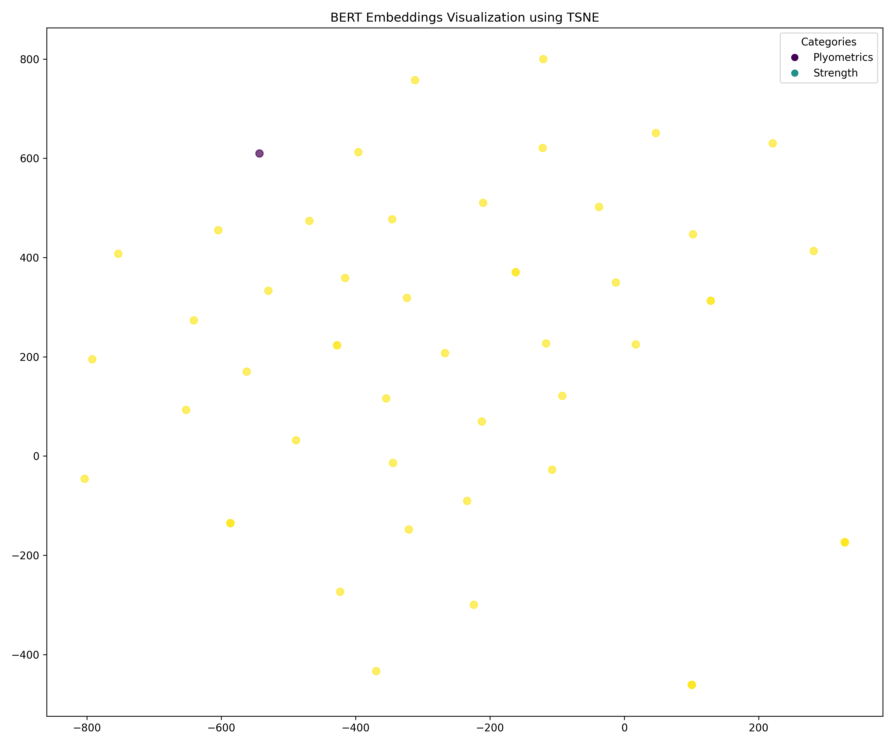

# Phase 2: Exercise Recommendation Frameworks Report

## 0. Embedding Visualizations

Visualizing embeddings helps us understand how exercises and fitness concepts are related in the vector space.

### Word2Vec Embeddings

Word2Vec captures semantic relationships between fitness terms:

*Word2Vec embeddings visualized using t-SNE*

### BERT Embeddings

BERT provides contextual embeddings of exercise descriptions, colored by exercise type:

*BERT embeddings visualized using t-SNE, colored by exercise type*

Different dimensionality reduction techniques (t-SNE, PCA, UMAP) offer various perspectives on how exercises relate to each other in the embedding space.

## 1. Chain of Thought (CoT) Implementation

Chain of Thought allows us to break down complex reasoning into step-by-step processes.

### Application to Exercise Recommendations

- Implemented a 6-step reasoning process for exercise matching
- Analyzed exercise characteristics, difficulty, benefits, and techniques
- Generated personalized recommendations based on user profiles

#### Example: User Alex Johnson

Fitness Level: Beginner
Goals: Weight loss, General fitness
Equipment: Body Only, Dumbbells

**Top Match Score**: 0.70

**Recommendation**: Good match with some considerations for your fitness level and goals.

## 2. Tree of Thought (ToT) Implementation

Tree of Thought explores multiple decision-making pathways for exercise recommendations.

### Workout Plan Decision Tree

- Primary Goal Path: Explores workout routines based on primary fitness goals
- Experience Level Path: Tailors recommendations to user's fitness experience
- Equipment-Based Path: Creates workout options based on available equipment

### Example Workout Branches

1. **Weight Loss Focus**
   - Cardio emphasis: HIIT -> Circuit Training -> Endurance Training
   - Strength component: Full Body -> Split Routines -> Specialized Training

2. **Muscle Building Focus**
   - Beginner -> Intermediate -> Advanced progression
   - Body weight -> Free weights -> Complex movements progression

## 3. Graph of Thought (GoT) Implementation

Graph of Thought maps relationships between exercises, equipment, and muscle groups.

### Exercise Relationship Network

- Created a graph of relationships between exercises and their attributes
- Identified complementary exercises that target related muscle groups
- Discovered exercise substitutions based on available equipment

### Key Insights

- Analyzed 2909 distinct exercises
- Mapped 17 body parts and 13 equipment types
- Identified 1244002 relationships between exercises

#### Most Versatile Body Parts (with most exercise options):
- Abdominals: 660 exercises
- Quadriceps: 645 exercises
- Shoulders: 338 exercises
- Chest: 260 exercises
- Biceps: 168 exercises

## 4. Integration of Reasoning Frameworks

These three reasoning frameworks combine to create a comprehensive exercise recommendation system:

1. **CoT** provides detailed analysis of how well exercises match user profiles
2. **ToT** explores branching workout pathways for progressive training
3. **GoT** maps the relationships between exercises for versatile workout planning

See visualizations in the `data/cot`, `data/tot`, and `data/got` directories.
